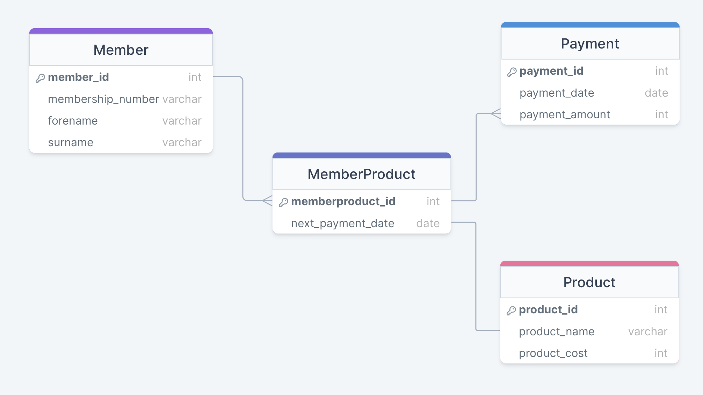
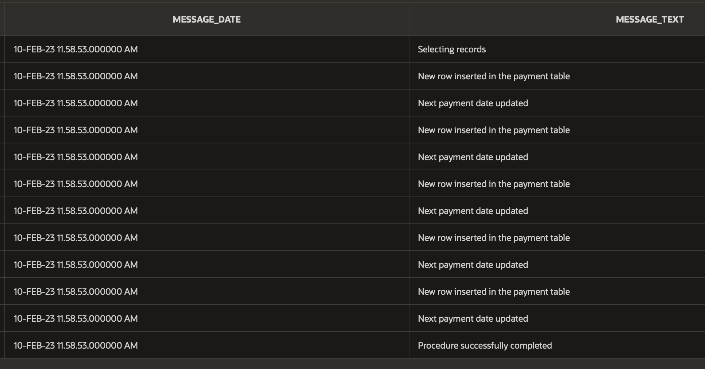

# UNATTENDED-TEST-DATABASE

 

## About The Project

For this project I didn't have access to a local Oracle database. However, I found `https://apex.oracle.com` which gave me access to a browser workspace where I could run and test my PL/SQL scripts.

The SQL script to create the tables and PL/SQL package procedure executed successfully on `https://apex.oracle.com`, but ultimately I'm not sure how closely the workspace mirrors a local Oracle database environment.

 

## My Assumptions

* MemberProducts with a next payment date within a 30 day period are due a payment.
* Membership numbers are stored as a VARCHAR data type
* I would implement an Autonomous Transaction logging System to ensure the log messages persist regardless of the procedure outcome and transaction state. As I didn't have access to a local Oracle database I was unable to install a logging framework (i.e. Logger) and went with the approach of creating a new table to store log messages.

 

## Data Model

My SQL script to build the schema was based on this data model:

 

## How I Would Test The Code

To test the code I created dummy data (see test-data.sql in the supporting-docs folder) which I populated into the tables.

I was then able to test my PL/SQL pacgake procedure and check that the inserts and updates had executed corrcetly and logging messages were created in the ProcessingLog table.

The test data includes 5 records with the next_payment_date set to 01-03-2023. These 5 records were selected by the PL/SQL package procedure which includes a select condition for records with a next_payment_date within 30 days of the current date.

This screenshot shows the ProcessingLog table after the PL/SQL package procedure was executed on the test data:

